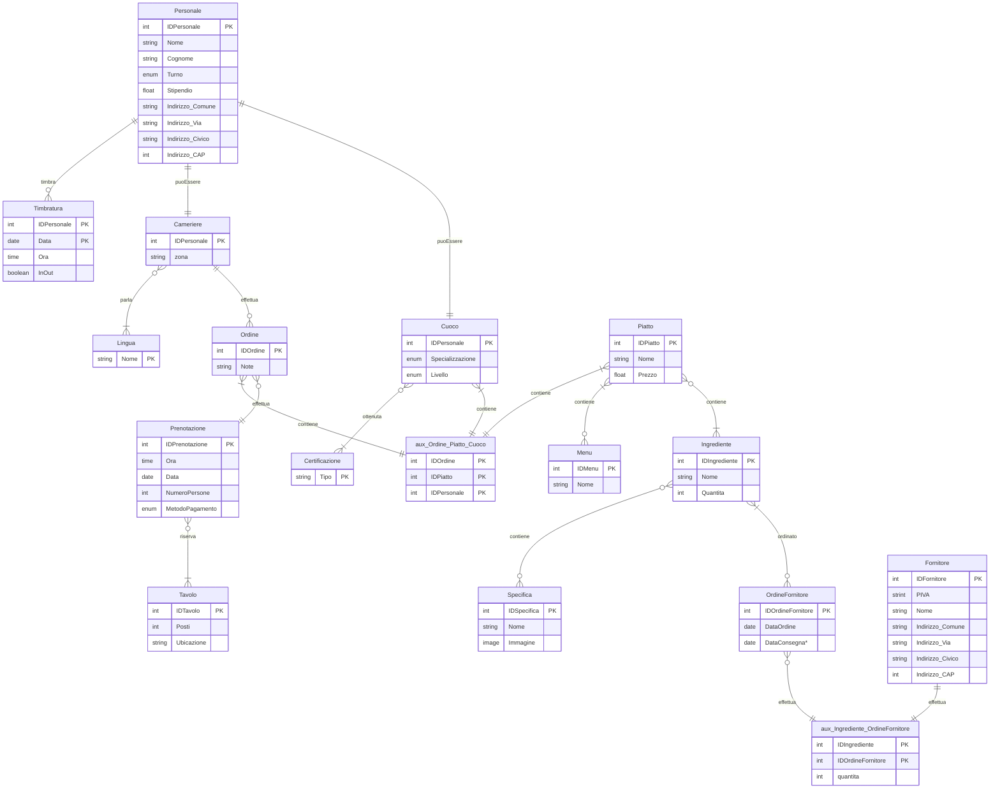

# Sistema di Gestione Ristorante
## Introduzione al progetto

## Analisi dei requisiti

## Diagramma ER 

```mermaid
erDiagram
    Personale ||--o{ Timbratura : timbra
    Personale ||--|| Cameriere : puoEssere
    Personale ||--|| Cuoco : puoEssere
    Cameriere o{--|{ Lingua : parla
    Cuoco o{--|{ Certificazione : ottenuta
    Cameriere ||--o{ Ordine : effettua
    Ordine |{--|| aux_Ordine_Piatto_Cuoco : contiene
    Piatto |{--|| aux_Ordine_Piatto_Cuoco : contiene
    Cuoco |{--|| aux_Ordine_Piatto_Cuoco : contiene
    Ordine o{--|| Prenotazione : effettua
    Prenotazione o{--|{ Tavolo : riserva
    Piatto |{--o{ Menu : contiene
    Piatto o{--|{ Ingrediente : contiene
    Ingrediente o{--o{ Specifica : contiene
    Ingrediente |{--o{ OrdineFornitore : ordinato
    OrdineFornitore o{--|| aux_Ingrediente_OrdineFornitore : effettua
    Fornitore ||--|| aux_Ingrediente_OrdineFornitore : effettua

    Personale{
        int IDPersonale PK
        string Nome
        string Cognome
        enum Turno
        float Stipendio
        string Indirizzo_Comune
        string Indirizzo_Via
        string Indirizzo_Civico
        int Indirizzo_CAP
    }

    Cameriere{
        int IDPersonale PK
        string zona
    }

    Cuoco{
        int IDPersonale PK
        enum Specializzazione
        enum Livello
    }

    Timbratura{
        int IDPersonale PK
        date Data PK
        time Ora 
        boolean InOut
    }

    Lingua{
        string Nome PK
    }

    Certificazione{
        string Tipo PK
    }

    Ordine{
        int IDOrdine PK
        string Note
    }
    
    Prenotazione{
        int IDPrenotazione PK
        time Ora
        date Data
        int NumeroPersone
        enum MetodoPagamento
    }

    Tavolo{
        int IDTavolo PK
        int Posti
        string Ubicazione
    }

    Piatto{
        int IDPiatto PK
        string Nome
        float Prezzo
    }

    Menu{
        int IDMenu PK
        string Nome
    }

    Ingrediente{
        int IDIngrediente PK
        string Nome
        int Quantita
    }

    Specifica{
        int IDSpecifica PK
        string Nome
        image Immagine
    }

    Fornitore{
        int IDFornitore PK
        strint PIVA
        string Nome
        string Indirizzo_Comune
        string Indirizzo_Via
        string Indirizzo_Civico
        int Indirizzo_CAP
    }

    OrdineFornitore{
        int IDOrdineFornitore PK
        date DataOrdine
        date DataConsegna*
    }

    aux_Ordine_Piatto_Cuoco{
        int IDOrdine PK
        int IDPiatto PK
        int IDPersonale PK
    }

    aux_Ingrediente_OrdineFornitore{
        int IDIngrediente PK
        int IDOrdineFornitore PK
        int quantita
    }
```

## Schema logico

## Dizionario dei dati

## Conclusioni