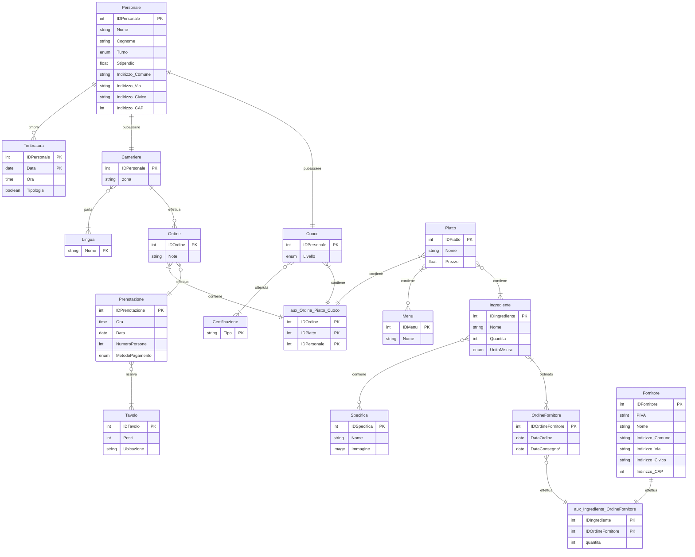

# Sistema di Gestione Ristorante
## Introduzione al progetto
Questo progetto ha come obiettivo la progettazione e la realizzazione di un sistema di gestione per un ristorante, basato su un database relazionale questa applicazione è in grado di gestire in modo efficace le principali attività dell'esercizio.

Un ristorante necessita di strumenti informatici che consentano di gestire in maniera ordinata e coerente tutte le informazioni, come ad esempio il menu, gli ordini dei clienti, la prenotazione dei tavoli, il personale, gli ordini ai fornitori e la gestione del magazzino. Una gestione efficace di questi dati permette all'esercente di migliorare l'efficienza del servizio, ridurre gli errori e ottimizzare le risorse disponibili.

Il progetto viene sviluppato seguendo un approccio strutturato, partendo dall'analisi dei requisiti, continuando con la modellazione concettuale tramite il diagramma Entità-Relazione, passando alla definizione dello schema logico relazionale e infine alla realizzazione dello script SQL.

Il progetto dell'applicazione viene salvato in un repository GitHub al seguente link: [repository GitHub](https://github.com/Thie15/progetto_db_gestione_ristorante), permettendo cosi il versionamento. Nel repository si troveranno i seguenti file:
 - README.md --> che contiene la relazione tecnica completa
 - database.sql --> che contiene lo script SQL

## Analisi dei requisiti
L'analisi dei requisiti ha come obbiettivo definire la funzionalità che il sistema di gestione del risotante deve offrire, individuando le informazioni da memorizzare e le operazioni da supportare.

### Gestione del personale
Il sistema immagazzinerà i dari anagrafici e contrattuali di tutto il personale del ristorante. Ogni membro sarà identificato univocamente e potrà svolgere uno dei seguenti ruoli:
 - Cameriere, associato a una zona di servizio e alle lingue che parla
 - Cuoco, caratterizzato da un livello professionale e dalle certificazioni che ha acquisito
Il sistema gestirà anche le timbrature, registrando per ogni dipenente data, ora sia di entrata che di uscita in modo da tracciare la presenza di tutti i membri del personale

### Gestione dei tavoli e delle prenotazioni
Il sistema gestirà i tavoli memorizzando il numero di posti e la sua ubicazione, le prenotazioni invece saranno costituite da: data, ora, numero di persone e metodo di pagamento. Ogni prenotazione può essere associata a uno o più tavoli per gestire in modo flessibile gli spazi in base al numero di clienti. Inoltre la prenotazione memorizza già il metodo di pagamento in modo da non creare confusioni con gli ordini dei clienti.

### Gestione degli ordini
Il sistema gestisce gli ordini associandoli a una prenotazione, per ogni ordine si possono inserire eventuali note che servono per richieste particolari del cliente, ad esempio la carne più al sangue o più cotta. Inoltre un'ordine deve poter includere più piatti e deve poter memorizzare il cuoco che li ha preparati in modo da gestire correttamente eventuali problemi con i piatti.

### Gestione del menu e dei piatti
Il sistema gestisce più menu, ad esempio: menu del giorno, menu di Natale, menu di Pasqua. Ogni piatto è identificato da un codice e contiene un nome e un prezzo, un piatto può appartenere a uno o più menu questo consente una gestione flessibile delle proposte. Inoltre ogni piatto è composto da uno o più ingredienti.

### Gestione degli ingredienti e delle specifiche
Il sistema memorizza gli ingredienti presenti in magazzino indicando per ciascuno il nome e la quantità disponibile. Gli ingredienti sono inoltre associati a una o più specifiche che permettono di gestire sia gli allergeni che le categorie come ad esempio il piccante.

### Gestione dei fornitori
Il sistema memorizza i fornitori con i dati identificativi e di contatto, inoltre registra gli ordini di approvvigionamento memorizzando la data dell'ordine, la data di consegna (se è gia stato consegnato) e il fornitore a cui si e ordinato. Ogni ordine può contenere più ingredienti indicando le quantità ordinate cosi da gestire in modo efficace il magazzino.

## Diagramma ER 

## Schema logico

Menu(<u>IDMenu</u>, Nome)

Piatti(<u>IDPiatto</u>, Nome, Prezzo)

Ingredienti(<u>IDIngrediente</u>, Nome, Quantita, UnitaMisura)

Specifiche(<u>IDSpecifica</u>, Nome, Immagine)

OrdiniFornitori(<u>IDOrdine</u>, DataOrdine, DataConsegna*, fkIDFornitore)

Fornitori(<u>IDFornitore</u>, PIVA, Nome, Indirizzo_Comune, Indirizzo_CAP, Indirizzo_Via, Indirizzo_Civico)

Ordini(<u>IDOrdine</u>, Note*, fkIDPrenotazione)

Prenotazioni(<u>IDPrenotazione</u>, Ora, Data, NumeroPersone, MetodoPagamento)

Tavoli(<u>IDTavolo</u>, Posti, Ubicazione)

Personale(<u>IDPersonale</u>, Nome, Cognome, Turno, Stipendio, Indirizzo_Comune, Indirizzo_CAP, Indirizzo_Via, Indirizzo_Civico)

Camerieri(<u>IDPersonale</u>, Zona)

Cuochi(<u>IDPersonale</u>, Livello)

Lingue(<u>Nome</u>)

Certificazioni(<u>Tipo</u>)

Timbrature(<u>IDPersonale</u>, <u>Data</u>, Ora, Tipologia)

aux_Camerieri_Lingue(<u>fkIDPersonale</u>, <u>fkNome</u>)

aux_Cuochi_Certificazioni(<u>fkIDPersonale</u>, <u>fkTipo</u>)

aux_Ordini_Cuochi_Piatti(<u>fkIDOrdine</u>, <u>fkIDPersonale</u>, <u>fkIDPiatto</u>)

aux_Prenotazioni_Tavoli(<u>fkIDPrenotazioni</u>, <u>fkIDTavolo</u>)

aux_Piatti_Ingredienti(<u>fkIDPiatti</u>, <u>fkIDIngredienti</u>)

aux_Ingredienti_Specifiche(<u>fkIDIngredienti</u>, <u>fkIDSpecifica</u>)

aux_Ingredienti_OrdiniFornitori(<u>fkIDSpecifica</u>, <u>fkIDOrdineFornitore</u>, Quantita, UnitaMisura)

## Dizionario dei dati

## Conclusioni